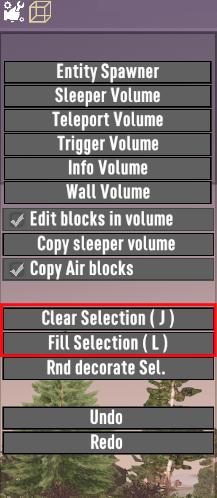

# 🎮 7 days to die - LevelToolEnabler

#### Why Use This Tool? 🤔

#### As you might have noticed, when you enable the level tool in a survival world in 7 Days to Die, the "Clear Selection" and "Fill Selection" buttons are greyed out and unclickable. Fear no more! Here, you will find all the necessary files to enable these buttons. Simply drag and drop the provided files to get them working. It can't get any easier than that!&#x20;

<figure><figcaption>
Buttons enabled
</figcaption></figure>

#### How It Works 🛠️

This tool modifies the games game code to unlock these features, providing you with more control and flexibility in your game-building endeavors.

#### Features 🌟

* Enable "Clear Selection" button
* Enable "Fill Selection" button
* Easy to use: Just drag and drop!

#### Lets get started!
