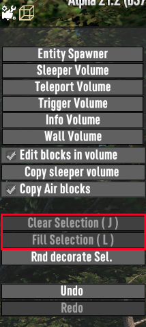

# 👋 7 days to die - LevelToolEnabler

### Why Use This Tool? 🤔

As you might have noticed, when you enable the level tool in a survival world in 7 Days to Die, the "Clear Selection" and "Fill Selection" buttons are greyed out and unclickable. i have now fixed this issue Simply drag and drop the provided files to get them working. It can't get any easier than that!

### FAQ

* **Does this work on a server?**\
  &#x20;_And the answer is yes but the cons of disabling eac. Head over to server setup for the guide on server_\

* **Do I need to disable Easy Anti-Cheat (EAC) to use this mod?**\
  Yes, you need to disable EAC to use this mod as it modifies the game's code. Carefully follow the guide\

* **Can this cause issues with my game?**\
  _modifying game files or game code can cause crashes or currpotions so always make sure to back up the game saves._ \

* **How do I install it?**\
  _Follow the detailed installation instructions provided here_\

* **I encountered a problem. What should I do?**\
  _Check the Issues section on the GitHub repository to see if your problem has already been reported. If not, feel free to open a new issue describing your problem in detail._

### Before

<figure><figcaption>
Buttons disabled
</figcaption></figure>

### After

<figure><figcaption>
Buttons enabled
</figcaption></figure>

### How It Works 🛠️

This tool modifies the games code to unlock these features. the reason its not found in windows.xml file is because when you switch gamemodes the check is implemented in the games code in order to check if you are in prefab or in survival therefore the check gets valid when prefab editor and denied when in survival&#x20;

### Features 🌟

* Enable "Clear Selection" button
* Enable "Fill Selection" button
* Works in singleplayer and multiplayer
* Easy to use: Just drag and drop!

#### Lets get started!

