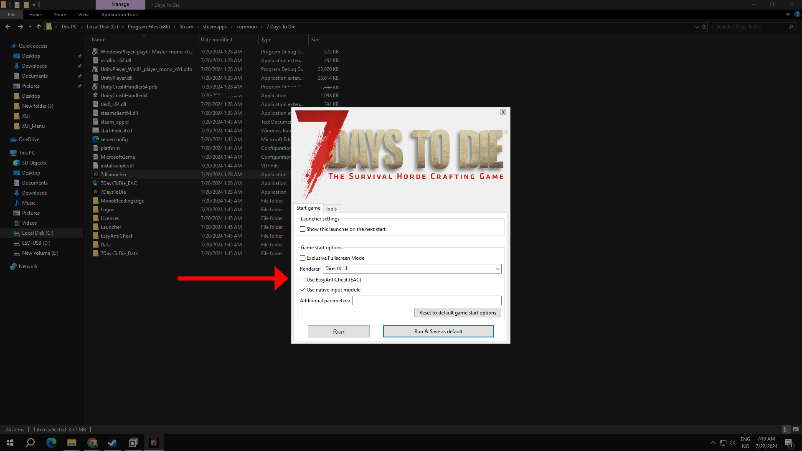

# ❌ step 1 - Disable Anti-Cheat

#### Disable Anti-Cheat ❌

Before proceeding with the installation, it is crucial to disable Easy Anti-Cheat (EAC). Running the game with EAC enabled while attempting to use modified files can result in conflicts and potentially prevent the modifications from functioning correctly or worst case senario bans. First head over to the game files and launch 7dlauncher and make sure the box is ticked off&#x20;

<figure><figcaption></figcaption></figure>

<figure><figcaption></figcaption></figure>

