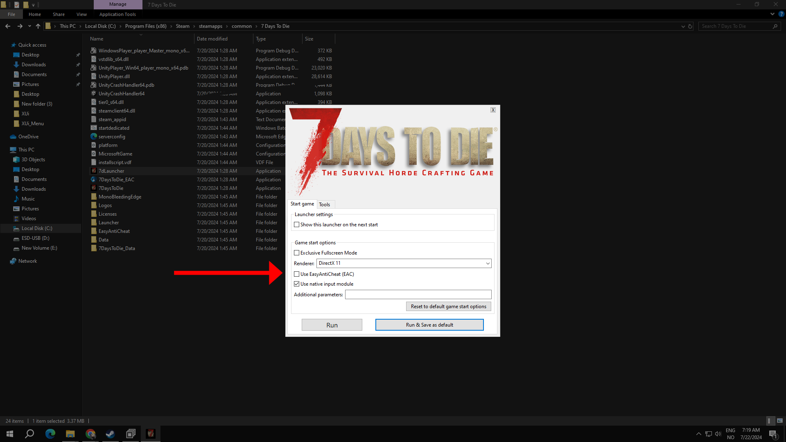

# ‼️ step 1 - important

#### Disable Anti-Cheat ❌

Before proceeding with the installation, it is crucial to disable Easy Anti-Cheat (EAC). Running the game with EAC enabled while attempting to use modified files can result in conflicts and potentially prevent the modifications from functioning correctly or worst case senario bans. First head over to the game files and launch 7dlauncher and make sure the box is ticked off&#x20;

<figure><figcaption></figcaption></figure>

<figure><figcaption></figcaption></figure>

Backup Your Game Files 💾

Modifying the game files always carries a risk of corrupting your game files or even save files. To ensure that you can restore your game to its original state if something goes wrong make sure you do a backup.

* Press Win + R on your keyboard to open the Run window.
* &#x20;Input %AppData% to the text box and press Enter to open the Roaming folder.&#x20;
* Go to 7DaysToDie > Saves and then you can find the save files.

presonally i would just copy the whole 7daystodie folder just to be extra safe&#x20;

## Warning ⚠️

**Do not** attempt to replace old files with new ones when the game updates without waiting for a new release from me. This can corrupt game files and lead to crashes or other issues. Always check for updates or new versions of the mod that are compatible with the latest game version.
